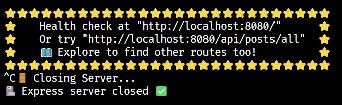

# TypeScript Exercise

## Before you start

👉 First, fork and clone this repository.

👉 Then run this command:

```
npm install
```

## Introduction

This repository contains two applications: a `server` and a `client`.

## Server

The `server` application is written using TypeScript, and is located in the `/server` folder.

👉 Have a look at the code in `/server/src/main.ts`. This is the starting point for the server.

The server is a very basic Node Express application. Express is a webserver which "listens" for requests and sends a response, depending on the URL of the request and any data sent along with it.

Don't worry if you're not familiar with Express yet - that's not the point of this exercise! Feel free to take some time to explore the rest of the code in `/server` to see if you can figure out what it's doing.

If you start the server using `npm run start-server` you will see the console output. When it finishes starting up, it shows a couple of example URLs you can use to interact with it. By default, these are:

`http://localhost:8080/`

and

`http://localhost:8080/api/posts/all`

👉 Start the server with `npm run start-server` and visit these URLs using your browser. (Or call them using a command line application such as `curl`, or a GUI such as `Postman`. Anything that makes HTTP requests can speak to the webserver.)

You should be able to see:

`http://localhost:8080/` - This should show a successful health check message.

`http://localhost:8080/api/posts/all` - This should show a list of blog posts in JSON format.

👉 Verify that the URL endpoints above are working correctly.

## Initial Exploration

The eventual goal of this exercise will be to take the `client` code and convert it to TypeScript.

Usually a `client` for an app like this would be a web frontend, perhaps built in a framework such as React.

But any app that makes HTTP requests can talk to a webserver, and in this case our `client` is another Node application which runs in the console.

👉 If the server is still running, stop it by pressing `Ctrl-C` in the terminal.



👉 Run the client ONLY by running the command `npm run start-client`

👉 Explore the client application in the console.

👉 You'll find that it fails if you try to contact the server.

👉 Stop the client by pressing `Ctrl-C` in the terminal.

👉 Often you would run both the server and client together by running a convenience command such as `npm start`. However, since these are both console-based applications it gets a little messy running them both in the same terminal instance.

👉 Open a second terminal. In one terminal run `npm run start-server` and in the other terminal run `npm run start-client`. Now your client can contact the server!

## Your Goal: Stage One

👉 Convert the client application to TypeScript.

👉 Since TypeScript is already configured for this project, you just need to rename files to `.ts` and start using the TypeScript features.

💡 It's up to you what to do. Perhaps you can rely on a lot of type inference, perhaps you want to define many custom types.

## Your Goal: Stage Two

👉 While converting, you'll have noticed that there are a couple of client features which haven't been implemented - including the ability to add new users.

👉 Implement the `Add Users` functionality. This will require adding a new endpoint to the server. Look in `setup_routes.ts` and see how the "Send Server Message" is implemented. You can use this as a basis for a new route which allows you to add a new user by sending the data along in the `body`.

💡 Currently the server generates a new array of users every time it is asked for one - can you get it to hold onto a specific array and alter it if a new user is added? (You don't need a database or file persistence for this - in-memory persistence is fine.)

👉 Can you also add functionality to add a new `post` to the server list, in the same way as with users?

## Extension Ideas

👉 Be creative if you like! Feel free to modify / improve the `server` and `client` applications if you can see ways they could be improved. The point is to learn, not to arrive at a predefined perfect solution!
