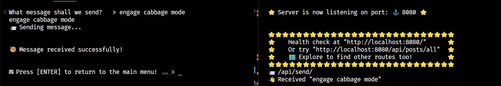

# TypeScript: A Terminal-Based Blog Browser

## Before you start

👉 First, fork and clone this repository.

👉 Then run this command:

```
npm install
```

## Prerequisite

❗❗ STOP ❗❗

👉 🔴 Use the command `node -v` and ensure you are running **_Node 18 or higher_** or this application will not work!

👉 If you're on `Node 18.12.0` or less then you will get some irritating warnings about "experimental features" in the terminal. You can remove these by upgrading to `Node 18.13.0` or above.

## Introduction

This repository contains two applications: a `server` and a `client`. We'll begin with the server.

## Starting the Server

The `server` application is written using TypeScript, and is located in the `/server` folder.

👉 Have a look at the code in `/server/src/main.ts`. This is the starting point for the server.

The server is a basic Node Express application. Express is a webserver which "listens" for requests and sends a response, depending on the URL of the request and any data sent along with it.

Don't worry if you're not familiar with Express yet - that's not the point of this exercise!

👉 If you start the server using `npm run start-server` you will see the console output. When it finishes starting up, it shows a couple of example URLs you can use to interact with it. By default, these are:

`http://localhost:8080/`

and

`http://localhost:8080/api/posts/all`

👉 Start the server with `npm run start-server` and visit these URLs using your browser. (Or call them using a command line application such as `curl`, or a GUI such as `Postman`. Anything that makes HTTP requests can speak to the webserver.)

You should be able to see:

`http://localhost:8080/` - This should show a successful health check message.

`http://localhost:8080/api/posts/all` - This should show a list of blog posts in JSON format.

👉 Verify that the URL endpoints above are working correctly.

💡 The most important part of the server logic is found in the `setup_routes.ts` file. This file hooks up URL routes (such as `http://localhost:8080/api/posts/all`) to the relevant logic. Since this server is basic, all of the logic takes place in that one file. This means you can see exactly what happens when you try to browse for, say, all posts, or all users.

👉 Take some time to explore the `setup_routes.ts` file in the server so you can get a sense for what it's doing. Again, don't worry if you don't exactly understand everything - see if you can spot the patterns of how the server returns some data to the client when it is requested.

## Initial Exploration

The eventual goal of this exercise will be to take the `client` code and convert it to TypeScript.

Normally, a `client` for an app like this would be a web frontend, perhaps built in a framework such as React.

But _any_ app that makes HTTP requests can talk to a webserver. In this case our `client` is another Node application which runs in the console. It uses the new `fetch` API in Node (which is based on `fetch` in browsers) to make requests to the server.

🤔 Let's try the client out. First, let's see how it works WITHOUT a server...

👉 If the server is still running, stop it by pressing `Ctrl-C` in the terminal.


👉 Start the client ONLY by running the command `npm run start-client`

👉 Use the terminal to explore the client application. Select menu options by entering numbers followed by the Enter key.

👉 You'll find that the client fails if you try to contact the server. This makes sense, as the server isn't running!

👉 Stop the client by pressing `Ctrl-C` in the terminal.

👉 Often developers run both a server and a client together during development, by running a convenience command such as `npm start` which they configure to start both a server and a frontend at once. However, since both parts of our application are console-based it gets a little messy if we try to run them both in the same terminal instance.

👉 Open a second terminal instance.

💡 In VS Code you can click the `Split` button in your terminal to open two terminals side-by-side (and most other modern terminal programs have similar functionality):



👉 In one terminal instance `npm run start-server` and in the other terminal run `npm run start-client`. Now your client can contact the server!

👉 Explore the client application now that the server is running. You should be able to send messages to the server and see them echoed in the server terminal, and to browse the users/posts returned from the server.

## Stage One - Convert Client to TypeScript

👉 Convert the client application to TypeScript.

👉 Since TypeScript is already configured for this project, you just need to rename files to `.ts` and start using TypeScript features.

🛑 In this case, it'll be easier if you rename _all_ the `.mjs` files in `client` to `.ts` at the same time. If you just rename some of them, you'll get weird module errors.

🛑 NB: Watch out for your `import` statements. When you convert to TypeScript, you should remove any file extensions, so:

```TypeScript
import { exit } from "./exit/exit.mjs";    // ❌ OLD
import { exit } from "./exit/exit";        // ✅ NEW - after renaming to "exit.ts"
```

👉 Once you've done that, you should have some fixable errors remaining.

👉 After that, it's up to you what to do. Here's some ideas you might consider:

💡 Hint: Adding type annotations to function parameters is an easy place to start.

💡 Hint: Think about using _const assertions_ (`as const`) to strongly-type things that are currently loose. For example, the `states` of the application can currently be set to any old string - this seems like something that would benefit from being restricted by a const assertion.

💡 You may find some bugs / inconsistencies in the existing JavaScript code that you can clean up by requiring consistent types in/out of the various functions being called.

💡 You may even want to restructure the program, or rewrite the menu so it uses generics instead of a giant `switch` case. (This may be tricky, but the experience of trying it could be valuable if you like a challenge!)

## EXTENSION ONE - Add a new endpoint for `Add Users`

👉 While converting, you may have noticed that there are a couple of client features which haven't been implemented - including the ability to add new users.

👉 Implement the `Add Users` functionality. This will require adding a new endpoint to the server which can take data.

💡 Look in `server/routes/routes.ts` to see how the "Send Server Message" is implemented. It receives a `body` from the HTTP request, which was sent from the `send_message_to_server` function in the client. Notice that the client has to specify certain headers and HTTP method types to pass a `body` along - you'll have to do this too.

👉 Create a new endpoint for adding a user. A route like `api/users/add` might be sensible - a bit like how `api/users/all` acts as a special case that returns all of the users. Copy the `api/users/all` code and put it where this marker has been left in the code:

```TypeScript
// ❗ [1] See README
```

👉 Change `all` to `add` in your new endpoint, and make it log something distinctive to the console when it gets called.

👉 The [Postman](https://www.postman.com/downloads/) application can be useful for sending HTTP requests directly to your server. If you need to debug calling your new endpoint you might find it helpful to craft a repeatable HTTP request in Postman that you can send with a single click.

👉 Write some client code to fetch from your new endpoint when the `Add user` menu option is selected. Follow the same patterns as the rest of the application. Base the implementation on the `sendMessage` menu option, as that does everything you need your new endpoint to do too - i.e. it sends a bunch of data to the server, which is what you want to do.

💡 Once you've got the client sending a body to your new "add users" endpoint, think about how you can get your endpoint to add this data to the list of users.

💡 Currently the server generates a completely new—but identical—array of users every time it is asked for one. Can you get the server to hold onto a specific array and alter it if a new user is added?

❗ You don't need a database or file persistence for this - in-memory persistence is fine. In other words, you just need to make the server have a single array of users - `api/users/all` needs to return that array, and your new "add user" endpoint needs to modify it.

## EXTENSION TWO - Add a new endpoint and menu option for `Add Posts`

👉 Can you also add functionality to add a new `post` to the server list, in the same way as with users? This would mean adding a new menu option too - which hopefully your TypeScript conversion will make simpler!

## EXTENSION THREE - Experiment

👉 Be creative if you like! Feel free to modify / improve the `server` and `client` applications if you can see ways they could be improved or features you could try to add. The point is to learn, not to arrive at a predefined perfect solution!

👉 Take some time to explore the rest of the code in `/server` to see if you can figure out how it works.
